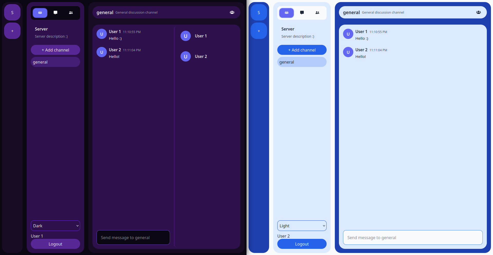

# 💬 Real-Time Chat

A web application for real-time messaging in servers and channels. Users can join servers, create channels, and send messages live. Built with a clean architecture backend and a feature-based React frontend.



## Technologies

| Layer | Stack |
|---|---|
| Frontend | Next.js (React + TypeScript) |
| Backend | Node.js (Express + TypeScript) |
| Databases | PostgreSQL, MongoDB, Cassandra |
| Caching | Redis |
| Real-time | Socket.IO |
| Infrastructure | Docker & Docker Compose |

## Repository Structure

```text
packages/
  shared/              # Shared TypeScript types used by both client and server
src/
  server/              # Express + Socket.IO backend
    controller/        # HTTP & WebSocket handlers
    services/          # Business logic
    repository/        # Data access
    domain/            # Entities & error types
    routes/            # API route definitions
  client/              # Next.js frontend
    src/
      components/
        features/      # Feature-based components (servers, channels, messages, DMs)
        layout/        # TaskBar, UserBar
        shared/        # Reusable UI components
      hooks/           # Custom React hooks
      stores/          # Zustand slices (server, channel, message, directMessage)
      services/        # API clients
sql/                   # PostgreSQL and Cassandra bootstrap scripts
```

The `@rtchat/shared` package contains all common type definitions, ensuring consistency across the stack.

### Architecture

**Backend** — clean layered architecture: Controllers → Services → Repositories. Interface-based design throughout for dependency injection.

**Frontend** — feature-based component organization, custom hooks for business logic (`useServerActions`, `useChannelNavigation`, etc.), Zustand store split into focused slices.

## Prerequisites

- [Node.js](https://nodejs.org/) 18+
- [Docker](https://docs.docker.com/get-docker/) and Docker Compose — required for the recommended setup; optional if running all services locally
- PostgreSQL, MongoDB, Cassandra, Redis — only needed for local development without Docker

## ⚙️ Configuration

Three environment setups are available depending on your use case:

| File | Purpose |
|---|---|
| `.env.docker.demo` (root) | Docker Compose demo — no manual DB setup needed |
| `src/server/.env.demo` | Local dev demo — services on localhost |
| `src/server/.env.example` | Local dev template — copy and customise |
| `.env.example` (root) | Docker template — copy and customise |

Key variables for a production setup:

- `JWT_SECRET` — minimum 32 characters
- `DEMO_MODE` — set to `false`
- `SERVER_PROFILE` and `NODE_ENV` — set to `production`
- `CORS_ORIGIN` — your frontend URL
- Database credentials for PostgreSQL, MongoDB, Cassandra, and Redis

See [src/server/env.ts](src/server/env.ts) for the full variable reference.

## 🚀 Running

### Option 1: Docker (recommended)

```bash
docker-compose --env-file .env.docker.demo up --build
```

Visit `http://localhost:3000`. No database setup required.

### Option 2: Local development

```bash
# Install workspace dependencies and build shared types
npm install
npm run build:shared

# Terminal 1 — backend
cd src/server && npm run dev:demo

# Terminal 2 — frontend
cd src/client && npm run dev:demo
```

For a custom config, copy the `.env.example` files in each module and fill in your values before running `npm run dev` instead of `npm run dev:demo`.

Database bootstrap scripts are in `sql/` — run `sql/pg/createTable.sql` for PostgreSQL and `sql/cassandra/createTable.cql` for Cassandra before starting the backend.

## License

[GPL-3.0](LICENSE)